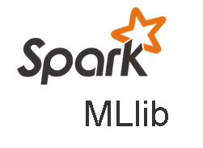

## Projetos utilizando Pyspark e MLlib

#### A ideia principal deste projeto é aprender a estrutura básica do Pyspark e do MLlib. Para isso o projeto foi dividido em 5 subprojetos, passando por regressão, classificação (binária,multiclasses e probabilística) e clusterização.
#### Para esses projetos foram utilizados um pseudocluster (uma única máquina).